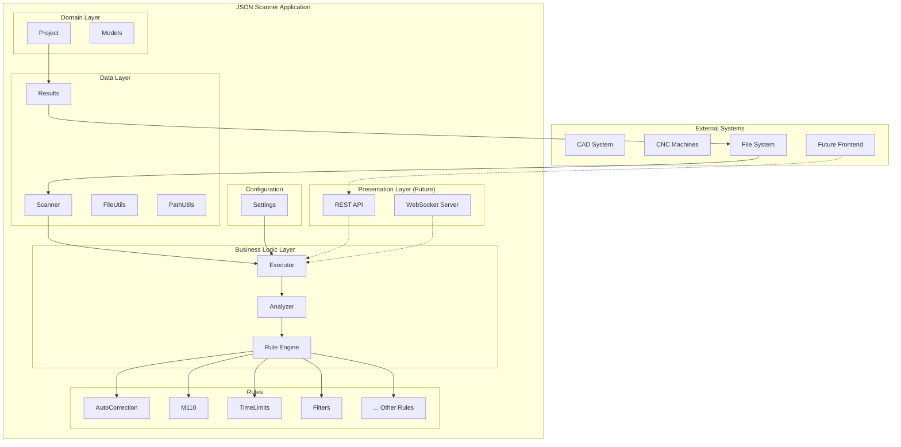
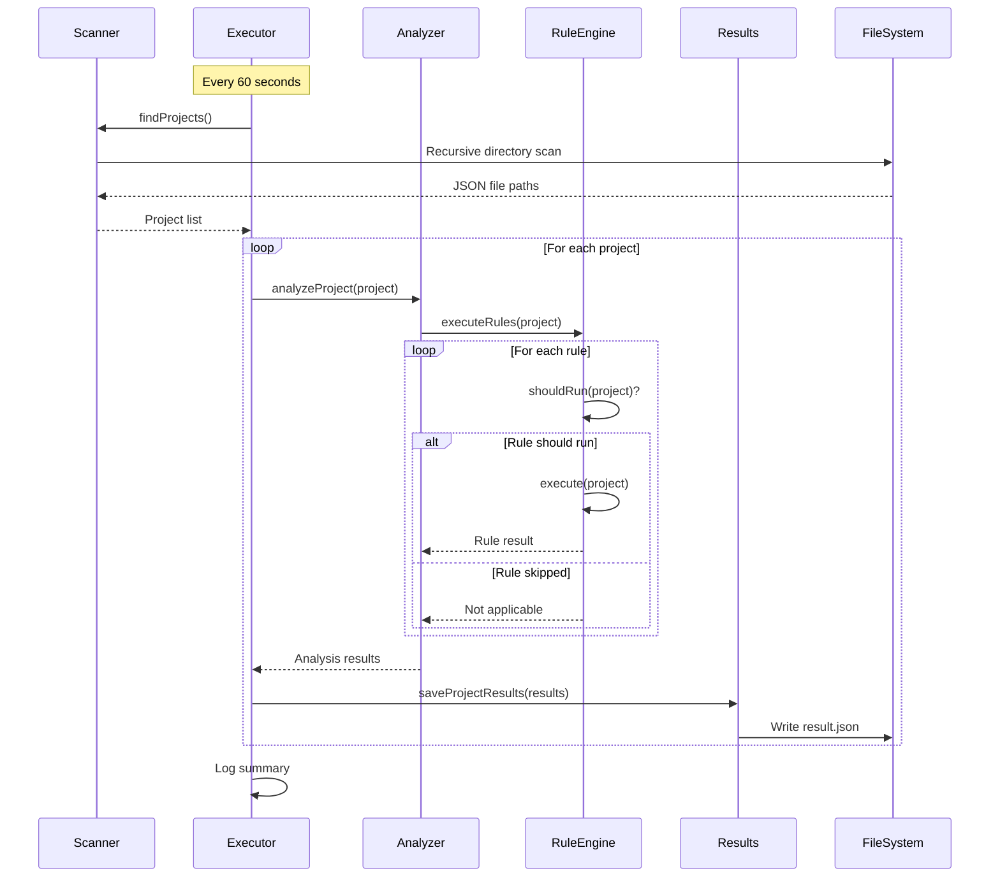
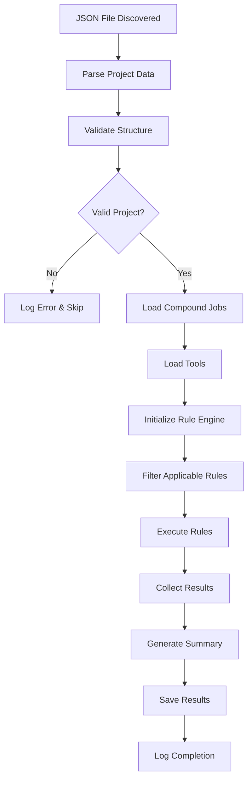
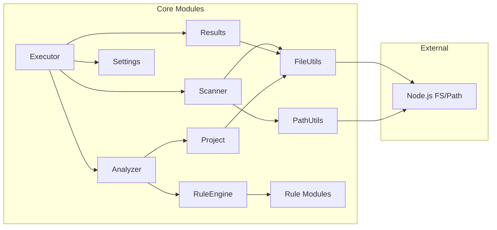
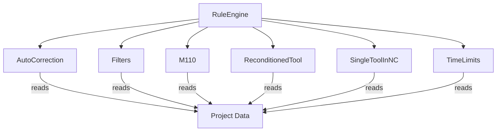

# Architecture Documentation

## System Overview

The JSON Scanner is a Node.js application designed for automated quality control analysis of manufacturing projects. It follows a clean architecture pattern with clear separation of concerns.

## Architecture Layers

### 1. Data Layer
**Location**: `core/`, `utils/`

**Responsibilities**:
- File system operations
- Data persistence
- JSON parsing and validation
- Directory scanning

**Key Components**:
- `Scanner.js`: Project discovery and file system traversal
- `Results.js`: Result persistence and retrieval
- `FileUtils.js`: Low-level file operations
- `PathUtils.js`: Path manipulation utilities

### 2. Business Logic Layer
**Location**: `core/analyzer/`, `core/executor/`, `rules/`

**Responsibilities**:
- Rule engine execution
- Project analysis
- Business rule validation
- Process orchestration

**Key Components**:
- `Executor.js`: Main business logic coordinator
- `RuleEngine.js`: Rule execution framework
- `Analyzer.js`: Project analysis orchestration
- Rule modules: Individual business rules

### 3. Domain Layer
**Location**: `core/project/`

**Responsibilities**:
- Domain model definitions
- Business entity management
- Data validation and transformation

**Key Components**:
- `Project.js`: Core project entity
- Domain-specific validation logic

### 4. Configuration Layer
**Location**: `config/`

**Responsibilities**:
- Application configuration
- Environment-specific settings
- Feature flags

**Key Components**:
- `Settings.js`: Centralized configuration management

## Component Architecture



## Data Flow

### 1. Automatic Scanning Cycle



### 2. Project Processing Pipeline



## Design Patterns

### 1. Strategy Pattern (Rule Engine)

```javascript
// Rule interface
class Rule {
  shouldRun(project) { /* implementation */ }
  execute(project, compoundJobs, tools) { /* implementation */ }
}

// Concrete implementations
class M110Rule extends Rule { /* ... */ }
class TimeLimitRule extends Rule { /* ... */ }

// Context
class RuleEngine {
  executeRules(project, rules) {
    return rules
      .filter(rule => rule.shouldRun(project))
      .map(rule => rule.execute(project));
  }
}
```

### 2. Factory Pattern (Project Creation)

```javascript
class ProjectFactory {
  static createFromFile(filePath) {
    const data = JSON.parse(fs.readFileSync(filePath));
    return new Project(data, filePath);
  }
  
  static createFromData(data, filePath) {
    return new Project(data, filePath);
  }
}
```

### 3. Observer Pattern (Future Event System)

```javascript
class EventEmitter {
  emit(eventName, data) { /* ... */ }
  on(eventName, callback) { /* ... */ }
}

class Executor extends EventEmitter {
  runAutorunCycle() {
    this.emit('scan:started');
    // ... processing
    this.emit('scan:completed', results);
  }
}
```

## Module Dependencies

### Core Dependencies



### Rule Dependencies



## Error Handling Strategy

### 1. Layered Error Handling

```javascript
// Business Layer
class Executor {
  async runAutorunCycle() {
    try {
      const projects = await this.scanner.findProjects();
      // ... processing
    } catch (error) {
      this.logger.error('Scan cycle failed:', error);
      // Continue with next cycle
    }
  }
}

// Data Layer
class Scanner {
  findProjects() {
    try {
      return this.recursiveJsonSearch();
    } catch (error) {
      throw new ScannerError('Failed to find projects', error);
    }
  }
}
```

### 2. Error Types

```javascript
class ApplicationError extends Error {
  constructor(message, code, details) {
    super(message);
    this.code = code;
    this.details = details;
  }
}

class ValidationError extends ApplicationError {}
class ProcessingError extends ApplicationError {}
class FileSystemError extends ApplicationError {}
```

## Configuration Management

### 1. Environment-Based Configuration

```javascript
// config/Settings.js
module.exports = {
  environment: process.env.NODE_ENV || 'development',
  
  scanning: {
    intervalMs: process.env.SCAN_INTERVAL || 60000,
    basePath: process.env.SCAN_PATH || './data',
    recursive: process.env.RECURSIVE_SCAN !== 'false'
  },
  
  logging: {
    level: process.env.LOG_LEVEL || 'info',
    file: process.env.LOG_FILE || './logs/application.log'
  },
  
  rules: {
    enabled: process.env.ENABLED_RULES?.split(',') || 'all'
  }
};
```

### 2. Feature Flags

```javascript
const config = {
  features: {
    autoScan: true,
    detailedLogging: true,
    resultCaching: false,
    parallelProcessing: false
  }
};
```

## Performance Considerations

### 1. Memory Management

- **Project Lifecycle**: Projects are processed one at a time and garbage collected
- **File Streaming**: Large files read in chunks when possible
- **Result Caching**: Optional result caching for frequently accessed data

### 2. I/O Optimization

```javascript
// Batch file operations
const results = await Promise.allSettled(
  projects.map(project => this.processProject(project))
);

// Stream large files
const stream = fs.createReadStream(filePath);
stream.on('data', chunk => { /* process chunk */ });
```

### 3. Scanning Optimization

```javascript
// Efficient directory traversal
class Scanner {
  recursiveJsonSearch(dir) {
    const entries = fs.readdirSync(dir, { withFileTypes: true });
    
    return entries.flatMap(entry => {
      const fullPath = path.join(dir, entry.name);
      
      if (entry.isDirectory()) {
        return this.recursiveJsonSearch(fullPath);
      } else if (entry.isFile() && entry.name.endsWith('.json')) {
        return [fullPath];
      }
      
      return [];
    });
  }
}
```

## Security Considerations

### 1. File System Security

- **Path Validation**: All file paths validated to prevent directory traversal
- **Permission Checks**: Read-only access to source files
- **Sandboxing**: Processing isolated to designated directories

### 2. Data Validation

```javascript
// Input sanitization
class ProjectValidator {
  static validate(projectData) {
    if (!projectData || typeof projectData !== 'object') {
      throw new ValidationError('Invalid project data');
    }
    
    // Validate required fields
    const required = ['name', 'operator', 'machine'];
    required.forEach(field => {
      if (!projectData[field]) {
        throw new ValidationError(`Missing required field: ${field}`);
      }
    });
    
    return true;
  }
}
```

## Scalability Design

### 1. Horizontal Scaling (Future)

```javascript
// Worker pool for parallel processing
class ProcessingPool {
  constructor(maxWorkers = 4) {
    this.workers = [];
    this.maxWorkers = maxWorkers;
    this.queue = [];
  }
  
  async process(project) {
    return new Promise((resolve, reject) => {
      this.queue.push({ project, resolve, reject });
      this.processQueue();
    });
  }
}
```

### 2. Database Integration (Future)

```javascript
// Repository pattern for data persistence
class ProjectRepository {
  async save(project) {
    // Database save operation
  }
  
  async findByOperator(operator) {
    // Database query
  }
  
  async getStatistics() {
    // Aggregated data queries
  }
}
```

## Testing Strategy

### 1. Unit Testing

```javascript
// Rule testing
describe('M110Rule', () => {
  test('should detect M110 operations', () => {
    const project = createTestProject();
    const rule = new M110Rule();
    
    const result = rule.execute(project);
    
    expect(result.passed).toBe(false);
    expect(result.violations).toHaveLength(2);
  });
});
```

### 2. Integration Testing

```javascript
// End-to-end workflow testing
describe('Scanner Integration', () => {
  test('should process complete project workflow', async () => {
    const executor = new Executor();
    const results = await executor.processProject(testProjectPath);
    
    expect(results.status).toBe('completed');
    expect(results.summary.totalRules).toBeGreaterThan(0);
  });
});
```

## Future Architecture Enhancements

### 1. Microservices Architecture

- **Scanner Service**: Project discovery and file monitoring
- **Analysis Service**: Rule execution and processing
- **Results Service**: Data persistence and retrieval
- **API Gateway**: Request routing and authentication

### 2. Event-Driven Architecture

```javascript
// Event bus for loose coupling
class EventBus {
  publish(event, data) {
    this.subscribers[event]?.forEach(handler => handler(data));
  }
  
  subscribe(event, handler) {
    this.subscribers[event] = this.subscribers[event] || [];
    this.subscribers[event].push(handler);
  }
}
```

### 3. Plugin Architecture

```javascript
// Plugin system for extensible rules
class PluginManager {
  loadPlugin(pluginPath) {
    const plugin = require(pluginPath);
    this.validatePlugin(plugin);
    this.registerPlugin(plugin);
  }
  
  executePlugins(context) {
    return this.plugins.map(plugin => plugin.execute(context));
  }
}
```

This architecture provides a solid foundation for current requirements while maintaining flexibility for future enhancements and scaling needs.